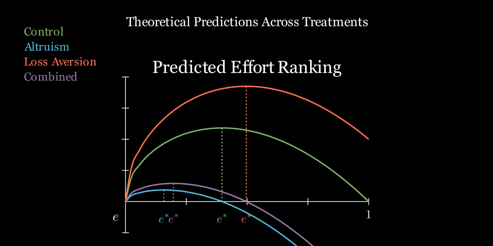

# Visualizing Experimental Economics Theory

This repository contains a short explainer video I made for my **Experimental and Behavioral Economics** course final presentation.

I probably worked for longer than I should have on this animation, so I wanted to share it for anyone interested! I thought it was pretty cool!

The video walks through the **theoretical predictions** of our experiment—covering the game-theoretic structure, equilibrium intuition, and the math behind what we expected participants to do. I went for a **3Blue1Brown-inspired** visual style because I wanted the formal theory to feel more intuitive and engaging!

The animation was used as a **background visual during a live presentation**, with key details explained verbally. Some labels and annotations are therefore omitted, as they were provided through narration rather than on-screen text.

## The Video

**Click the thumbnail or the button below to download the full presentation video (MP4).**

**[Download the video (MP4)](https://raw.githubusercontent.com/zwinship/visualizing-experimental-econ-theory/main/EffortModel.mp4)**

## What's in the Video

I cover:
- The game-theoretic setup of the experiment
- Predicted equilibria and comparative statics of treatment effects
- The mathematical intuition driving those predictions

## The Code

The animation was built in Python.

- `animation.py` — The script that generates the video
  - Vector-based animations
  - Mathematical transitions
  - Step-by-step theoretical buildup

## Context

- **Course:**  Behavioral  and Experimental Economics
- **Project:** Semester final experiment
- **My role:** Theoretical modeling and presentation
- **Audience:** Undergraduate economics students

## Acknowledgments

Big thanks to **3Blue1Brown** for the visual inspiration and for showing how math explanations can be both rigorous and beautiful.
